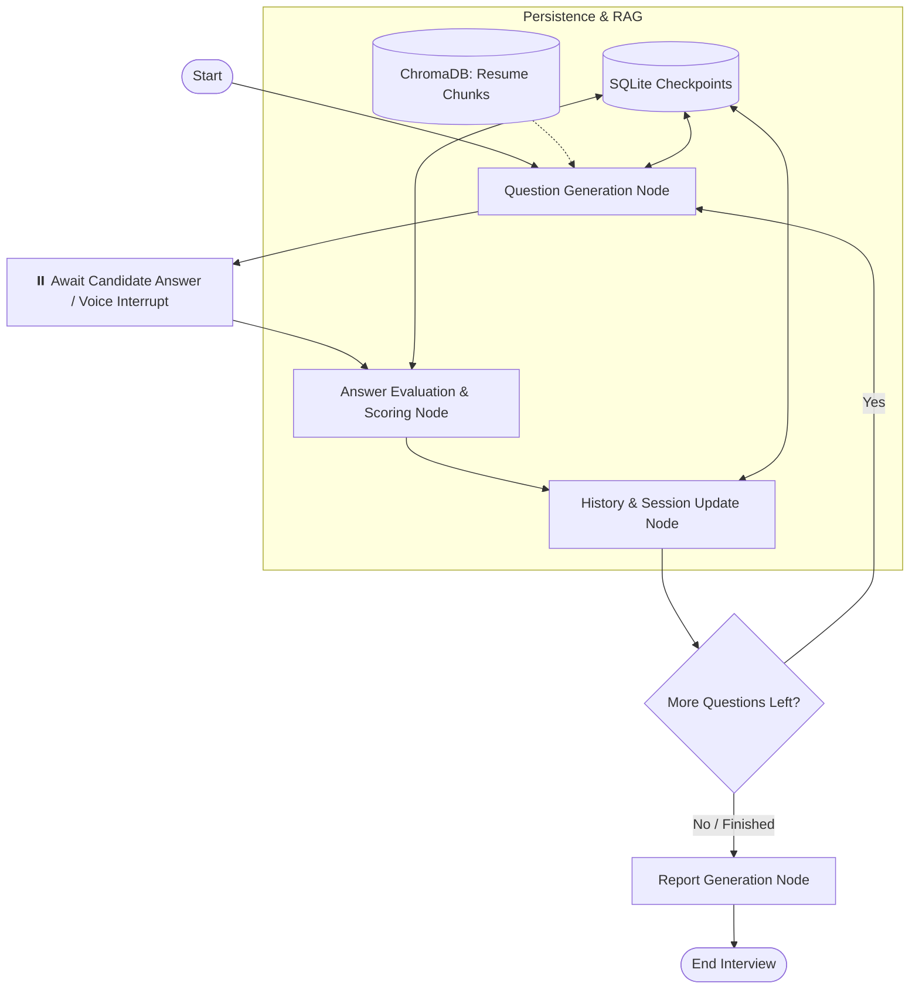

# 🎙️ Veya — AI Voice Mock Interview Assistant

<div align="center">

[](https://veya.web.app)
[](https://fastapi.tiangolo.com)
[](https://www.langchain.com/langgraph)
[](https://groq.com)
[](https://react.dev)
[](https://www.python.org)
[](LICENSE)

**An intelligent, voice-first mock interview assistant that analyzes your resume, conducts adaptive technical interviews, and provides comprehensive rubric-based performance evaluations.**

[🚀 **Explore the Live App**](https://veya.web.app) • [📖 **API Documentation**](#-api-reference) • [🛠️ **Quick Start**](#-getting-started) • [🏗️ **Architecture**](#-architecture)

</div>

---

## 🌟 Overview

**Veya** transforms technical interview preparation by combining cutting-edge LLM orchestration, retrieval-augmented generation (RAG), and real-time speech processing into a fluid, conversational experience:

1. **Voice Onboarding**: Start an interview conversation naturally through speech.
2. **Resume-Aware RAG**: Upload your resume to have interview questions tailored directly to your actual projects, skills, and experience level.
3. **Adaptive Multi-Agent Interview**: Engage in dynamic question-and-answer rounds orchestrated by a LangGraph state machine.
4. **Instant Actionable Feedback**: Receive detailed rubric scoring, constructive critiques, and an actionable final performance report.

---

## ✨ Key Features

- **🎙️ Full Voice-Driven Interaction**: Real-time speech-to-text with `faster-whisper` and natural neural speech synthesis via `edge-tts`.
- **📄 Contextual Resume RAG**: Seamless PDF resume parsing chunked and embedded in `ChromaDB` so questions test your real-world experience.
- **🧠 Multi-Agent State Machine**: LangGraph-powered cyclic state workflow (`question` ➔ `interrupt` ➔ `evaluation` ➔ `history` ➔ `report`) with state persistence via `AsyncSqliteSaver`.
- **⚡ Ultra-Low Latency Inference**: Accelerated by Groq LPUs running modern high-throughput open LLMs (`qwen/qwen3-32b`).
- **📊 Comprehensive Scoring & Reports**: Rubric-based scoring across clarity, technical correctness, depth, and structured feedback per question.
- **🛡️ Production-Grade Core**: Asynchronous concurrency management, SlowAPI rate-limiting, periodic memory cleanup, and automated SSL fallback handling.

---

## 📸 Screenshots

<div align="center">
  <table>
    <tr>
      <td width="50%">
        <h4 align="center">Landing Page & Voice Orb</h4>
        
      </td>
      <td width="50%">
        <h4 align="center">Interview Experience & Features</h4>
        
      </td>
    </tr>
    <tr>
      <td width="50%">
        <h4 align="center">Resume Upload & Role Setup</h4>
        
      </td>
      <td width="50%">
        <h4 align="center">Live Voice Interview Session</h4>
        
      </td>
    </tr>
    <tr>
      <td width="50%">
        <h4 align="center">Interactive Voice Controls & Transcript</h4>
        
      </td>
      <td width="50%">
        <h4 align="center">Detailed Performance Report</h4>
        
      </td>
    </tr>
  </table>
</div>

---

## 🏗️ Architecture

### Interview State Machine

Veya uses **LangGraph** to model the cyclical interview loop. The state machine pauses after generating each question, awaits user voice submission, scores the response, logs conversation history, and decides whether to ask the next question or generate the final summary report.



### System Architecture Flow

```
Candidate Audio / Resume (PDF)
              │
              ▼
   ┌──────────────────────┐
   │ React + Vite Client  │ (Tailwind CSS, Voice Orb, Web Audio API)
   └──────────┬───────────┘
              │ HTTP / Multipart
              ▼
   ┌──────────────────────┐
   │   FastAPI Backend    │ (Rate Limiting, Lifespan Management, Sweeper)
   └──────┬────────┬──────┘
          │        │
          │        ├─► [faster-whisper] ──► Speech-to-Text Transcription
          │        ├─► [edge-tts]       ──► Neural Speech Generation
          │        └─► [pypdf + Chroma] ──► Resume Vector Extraction
          │
          ▼
   ┌──────────────────────┐
   │ LangGraph Controller │ ──► Groq Cloud (Qwen 32B LLM)
   │ (AsyncSqliteSaver)   │
   └──────────────────────┘
```

---

## 🛠️ Tech Stack

| Domain | Technology | Purpose |
|---|---|---|
| **Backend Framework** | [FastAPI](https://fastapi.tiangolo.com/) | High-performance async REST API and file streaming |
| **Agent Orchestration** | [LangGraph](https://www.langchain.com/langgraph) | Cyclic graph state machine with interrupt handling |
| **Inference Engine** | [Groq](https://groq.com/) | High-speed LLM inference (`qwen/qwen3-32b`) |
| **Vector Database** | [ChromaDB](https://www.trychroma.com/) | Local vector store for resume context retrieval |
| **Speech-to-Text (STT)** | [faster-whisper](https://github.com/SYSTRAN/faster-whisper) | Optimized Whisper model for high-accuracy transcription |
| **Text-to-Speech (TTS)** | [edge-tts](https://github.com/rany2/edge-tts) | Realistic multi-lingual neural speech generation |
| **State Persistence** | [aiosqlite](https://github.com/omnilib/aiosqlite) | Async SQLite checkpointer for LangGraph execution |
| **Frontend UI** | [React 19](https://react.dev/) + [Vite](https://vitejs.dev/) | Ultra-responsive SPA with dynamic voice visualization |
| **Styling** | [Tailwind CSS](https://tailwindcss.com/) | Modern responsive design with glassmorphism effects |
| **Hosting** | [Firebase Hosting](https://firebase.google.com/) | Global edge CDN hosting for the web application |

---

## 🚀 Getting Started

### Prerequisites

- **Python:** 3.14+ (or 3.11+)
- **Node.js:** 18+ & npm
- **Package Manager:** [uv](https://github.com/astral-sh/uv) (recommended) or `pip`
- **Groq API Key:** Free key available from [Groq Console](https://console.groq.com/)

### 1. Clone the Repository

```bash
git clone https://github.com/Amal070/Veya-AI.git
cd Veya-AI
```

### 2. Backend Setup

```bash
# Copy and configure environment variables
cp .env.example .env

# Edit .env and paste your Groq API key:
# GROQ_API_KEY=gsk_...
```

**Using `uv` (Recommended):**
```bash
uv sync
```

**Using `pip` / virtualenv:**
```bash
python -m venv .venv
# Windows:
.venv\Scripts\activate
# Linux/macOS:
source .venv/bin/activate

pip install -r requirements.txt
```

### 3. Frontend Setup

```bash
cd frontend
npm install
cd ..
```

---

## 💻 Running the Application

### Start Backend Server

```bash
# From repository root
uvicorn app.main:app --reload --port 8000
```
*API documentation will be available at [http://localhost:8000/docs](http://localhost:8000/docs).*

### Start Frontend Dev Server

```bash
cd frontend
npm run dev
```
*Open [http://localhost:5173](http://localhost:5173) in your browser.*

---

## 📡 API Reference

### Voice & Onboarding

| Method | Endpoint | Description |
|---|---|---|
| `POST` | `/voice/chat` | Send recorded voice audio for general voice onboarding |
| `POST` | `/voice/transcribe` | Transcribe an audio snippet directly to text |
| `WS` | `/ws/voice` | WebSocket endpoint for real-time voice streaming |

### Resume Processing (RAG)

| Method | Endpoint | Description |
|---|---|---|
| `POST` | `/resume/upload` | Upload PDF resume to chunk, embed, and index in ChromaDB |

### Interview State Machine

| Method | Endpoint | Description |
|---|---|---|
| `POST` | `/interview/start` | Initialize session and receive the first interview question |
| `POST` | `/interview/voice/answer` | Submit recorded voice answer, evaluate, and fetch next question |
| `POST` | `/interview/answer` | Submit text answer directly (for programmatic / test runs) |
| `POST` | `/interview/skip` | Skip the active question and progress to the next |
| `POST` | `/interview/end` | Gracefully end interview early and compute performance report |
| `GET` | `/interview/report/{session_id}` | Retrieve final structured evaluation report |

### System & Health

| Method | Endpoint | Description |
|---|---|---|
| `GET` | `/health` | Server health check and uptime probe |

---

## ⚙️ Configuration

All configuration variables can be defined in `.env` with the `VEYA_` prefix:

| Variable | Default | Description |
|---|---|---|
| `GROQ_API_KEY` | *(Required)* | API key for Groq Cloud LLM inference |
| `VEYA_LLM_MODEL` | `qwen/qwen3-32b` | Model used for interview generation and evaluation |
| `VEYA_LLM_TIMEOUT_SECONDS` | `20.0` | Timeout threshold for individual LLM requests |
| `VEYA_LLM_MAX_RETRIES` | `2` | Bounded retries before failing gracefully |
| `VEYA_WHISPER_MODEL_SIZE` | `base` | Whisper model size (`tiny`, `base`, `small`, `medium`) |
| `VEYA_WHISPER_DEVICE` | `cpu` | Inference device for Whisper (`cpu` or `cuda`) |
| `VEYA_TTS_VOICE` | `en-IN-NeerjaNeural` | Microsoft Edge TTS neural voice model |
| `VEYA_TTS_RATE` | `+18%` | Speed multiplier for generated speech |
| `VEYA_CHROMA_DB_PATH` | `veya_chroma_db` | Storage path for Chroma vector embeddings |
| `VEYA_CHECKPOINT_DB_PATH`| `veya_checkpoints.sqlite` | SQLite database file for LangGraph state checkpoints |
| `VEYA_DEFAULT_QUESTION_COUNT` | `5` | Default number of interview questions per session |

---

## 🧪 Testing

Run automated tests using `pytest`:

```bash
pytest
```

To run individual test suites:
```bash
pytest tests/test_interview_helpers.py
pytest tests/test_report_agent.py
pytest tests/test_router.py
```

---

## 📂 Repository Structure

```
Veya-AI/
├── app/
│   ├── agents/            # Specialized agents (Interviewer, Evaluator, Report, Resume)
│   ├── graph/             # LangGraph state machine, nodes, router & runtime
│   ├── prompts/           # Evaluation and interview prompt templates
│   ├── rag/               # PDF chunking, embedding, and ChromaDB vector store
│   ├── routes/            # FastAPI endpoints (interview, resume, voice, ws_voice)
│   ├── services/          # Session cache and resume context managers
│   ├── tools/             # STT (Whisper), TTS (Edge-TTS), PDF parser, text cleaners
│   ├── config.py          # Pydantic BaseSettings management
│   ├── llm.py             # Groq LLM client with timeout & retry wrappers
│   └── main.py            # FastAPI application entrypoint & lifespan
├── frontend/
│   ├── src/
│   │   ├── components/    # ConversationView, VoiceOrb, MicControl, Modals
│   │   ├── hooks/         # Audio recorder & Veya state hooks
│   │   ├── pages/         # Home, Interview, and Report pages
│   │   └── services/      # Axios API clients
│   └── vite.config.js     # Vite configuration
├── tests/                 # Automated test suite
├── .env.example           # Template environment configuration
└── pyproject.toml         # Python project dependencies and metadata
```

---

## 📄 License

This project is licensed under the **MIT License**. See the [LICENSE](LICENSE) file for details.

<div align="center">
Made with ❤️ by <a href="https://github.com/Amal070">Amal</a>
</div>
