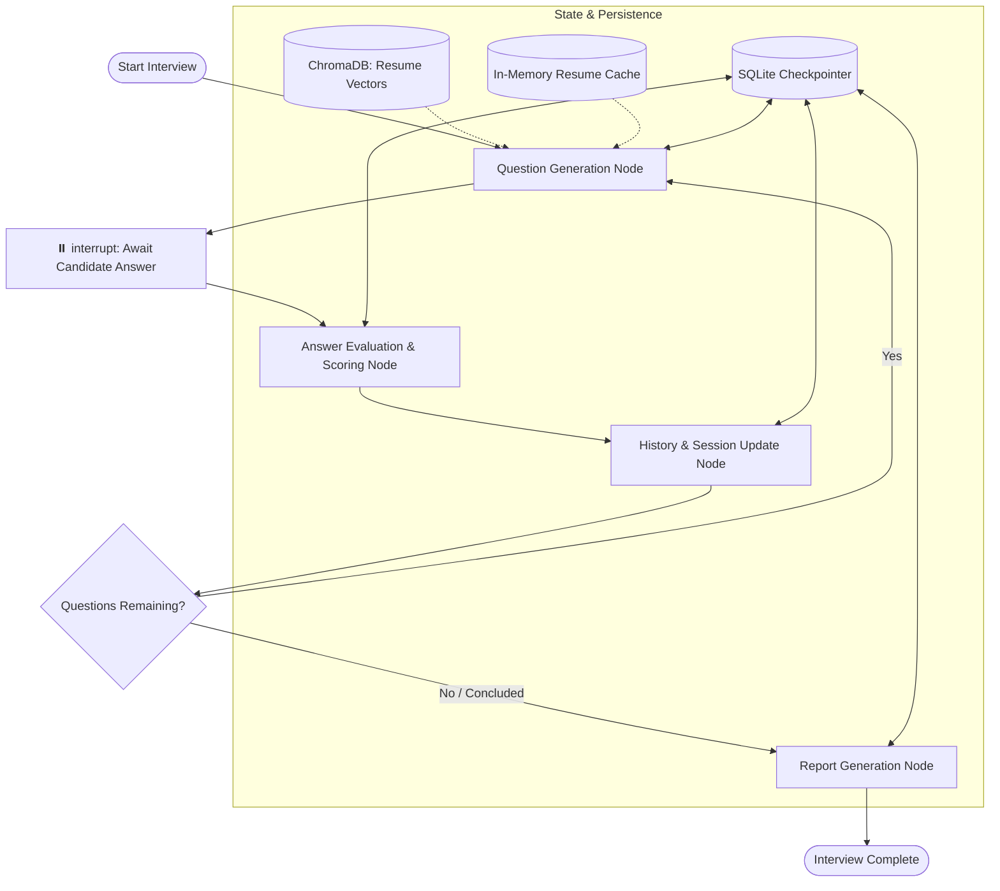

# 🎙️ Veya — AI Voice Mock Interview Assistant

<div align="center">

[](https://veya.web.app)
[](https://fastapi.tiangolo.com)
[](https://www.langchain.com/langgraph)
[](https://groq.com)
[](https://react.dev)
[](https://tailwindcss.com)
[-3776AB?style=for-the-badge&logo=python&logoColor=white)](https://www.python.org)
[](LICENSE)

**An intelligent, voice-first mock interview assistant that analyzes your resume, conducts adaptive multi-turn technical interviews across calibrated difficulty tiers, and delivers comprehensive rubric-based performance evaluations.**

[🚀 **Explore the Live App**](https://veya.web.app) • [📖 **API Documentation**](#-api-reference) • [🛠️ **Quick Start**](#-getting-started) • [🏗️ **Architecture**](#-architecture) • [🎯 **Difficulty & Evaluation**](#-difficulty--evaluation-engine)

</div>

---

## 🌟 Overview

**Veya** transforms technical interview preparation by combining cutting-edge LLM orchestration, multi-format retrieval-augmented generation (RAG), and dual-mode speech processing into a fluid, conversational experience:

1. **Multi-Format Resume Ingestion**: Upload resumes in **PDF, DOCX, or TXT** formats. Veya extracts your skills, projects, and tech stack into structured candidate profiles and semantic vector stores via **ChromaDB**.
2. **Adaptive Multi-Agent State Machine**: Powered by **LangGraph**, Veya orchestrates cyclical interview turns with state persistence through `AsyncSqliteSaver`, managing human-in-the-loop interrupts seamlessly.
3. **Calibrated Difficulty & Role Targeting**: Select **Easy** (Fundamentals), **Medium** (Implementation & Trade-offs), or **Hard** (Architecture, Security, & Scale), optionally specifying a target job role.
4. **Intelligent Question Sequencing & Deduplication**: Employs a dynamic category sequence (`resume_project` ➔ `follow_up` ➔ `technical_skill` ➔ `role_specific` ➔ `problem_solving`) combined with semantic and exact token overlap deduplication.
5. **Dual Voice Processing**:
   - **REST Turn-Based Voice**: Record audio answers on-demand via HTTP with automatic speech-to-text (`faster-whisper`) and neural speech output (`edge-tts`).
   - **Streaming WebSocket Pipeline**: Full-duplex WebSocket audio streaming (`/ws/voice`) with energy-based Voice Activity Detection (VAD), automatic mic gating, and candidate barge-in interruption.
6. **Multi-Dimensional Rubric Scoring**: Scores every answer across *Technical Knowledge*, *Communication*, *Confidence*, and *Problem Solving* alongside calibrated overall marks and actionable feedback.
7. **Comprehensive Performance Reports**: Concludes with an in-depth candidate performance report featuring overall readiness scores (0-100), key strengths, areas for improvement, and tailored recommendations.

---

## ✨ Key Features

- **🎙️ Dual Voice Interaction Modes**:
  - **Turn-Based REST**: Low-friction audio recording with automatic audio validation, transcription, and spoken audio feedback.
  - **WebSocket Live Stream (`/ws/voice`)**: Real-time binary PCM16 audio streaming with `UtteranceSegmenter` VAD, automatic mic muting while the AI speaks, and client barge-in detection.
- **📄 Multi-Format Resume RAG (PDF, DOCX, TXT)**:
  - Validates file integrity (PDF magic bytes, DOCX package structures, multi-encoding TXT decoding).
  - Chunks and stores embeddings into local `ChromaDB` vector collections.
  - Generates structured profile metadata (projects, frameworks, languages, databases, tools) with LLM and resilient regex heuristics.
- **🧠 LangGraph Interview State Machine**:
  - Cyclical state loop: `question_node` ➔ `interrupt` ➔ `evaluation_node` ➔ `history_node` ➔ `continue_router` ➔ `report_node`.
  - State persisted across sessions using asynchronous SQLite checkpointer (`AsyncSqliteSaver`) with synchronous fallback.
- **🎯 3-Tier Difficulty Calibration & Deduplication**:
  - Rigorous difficulty scaling ensuring questions match candidate seniority (Easy / Medium / Hard).
  - Dynamic category progression preventing repetitive question patterns.
  - Semantic token-overlap deduplication (`threshold: 0.70`) and resume-grounded fallback synthesis when LLM is unavailable.
- **📊 Granular Rubric Scoring & Analytics**:
  - 4-dimensional evaluation per answer: *Technical Knowledge*, *Communication*, *Confidence*, and *Problem Solving* (1-10 scale).
  - Executive summary and categorical scores (0-100) rendered with interactive animated score rings and downloadable reports.
- **⚡ Ultra-Low Latency Inference**:
  - Powered by Groq LPUs running modern high-throughput open LLMs (`qwen/qwen3.8-27b`).
- **🛡️ Production-Grade Core**:
  - Asynchronous concurrency throughout.
  - SlowAPI rate-limiting per route.
  - Periodic background sweeper (`_session_sweeper`) evicting idle sessions and cached resume contexts.
  - Security headers middleware (`nosniff`, `DENY`, `strict-origin-when-cross-origin`).
  - Automatic temporary audio file cleanup.

---

## 🏗️ Architecture

### LangGraph Interview State Machine

Veya models technical interview execution as a cyclical state machine. The graph pauses execution after generating each question using `interrupt()`, waits for the candidate's answer (via text or voice), evaluates the submission, logs the turn in history, and routes to either the next question or the final report.



### End-to-End System Flow

```
                      Candidate Audio / Resume (PDF, DOCX, TXT)
                                         │
                                         ▼
                 ┌────────────────────────────────────────────────┐
                 │       React 19 + Vite 8 Client UI              │
                 │  - VoiceOrb & Waveform Visualizer              │
                 │  - Setup Modal (Difficulty, Role, Question #)  │
                 │  - Dual Mode: REST Audio or Live WebSocket     │
                 └───────────────┬────────────────┬───────────────┘
                                 │                │
                     HTTP / Multipart        WebSocket (/ws/voice)
                                 │                │
                                 ▼                ▼
                 ┌────────────────────────────────────────────────┐
                 │             FastAPI Backend Core               │
                 │  - SlowAPI Rate Limiter & Security Headers     │
                 │  - Session & Resume Cache Sweeper              │
                 │  - VAD Energy Segmenter (Barge-in Support)     │
                 └───────┬──────────────┬─────────────────┬───────┘
                         │              │                 │
                         ▼              ▼                 ▼
                 ┌──────────────┐ ┌──────────────┐ ┌──────────────┐
                 │faster-whisper│ │   edge-tts   │ │ChromaDB RAG  │
                 │ (STT: int8)  │ │(Neural Voice)│ │ (Embeddings) │
                 └──────────────┘ └──────────────┘ └──────────────┘
                                        │
                                        ▼
                 ┌────────────────────────────────────────────────┐
                 │        LangGraph Cyclic State Machine          │
                 │     (AsyncSqliteSaver State Persistence)       │
                 └──────────────────────┬─────────────────────────┘
                                        │
                                        ▼
                 ┌────────────────────────────────────────────────┐
                 │         Groq LPU Inference Cloud               │
                 │            (qwen/qwen3.8-27b)                  │
                 └────────────────────────────────────────────────┘
```

---

## 🎯 Difficulty & Evaluation Engine

### Difficulty Calibration Tiers

| Tier | Level | Complexity | Focus Areas | Expected Depth |
|---|---|---|---|---|
| **`easy`** | Beginner | Low | Fundamentals, core definitions, basic syntax, direct resume project descriptions. | Clear, single-concept explanations without complex theory. |
| **`medium`** | Intermediate | Moderate | Practical implementation, technical decisions, trade-offs, debugging, and multi-concept workflows. | Detailed explanations with practical examples and rationale. |
| **`hard`** | Advanced | High | System architecture, scalability under load, concurrency, security vulnerabilities, edge cases, root-cause analysis. | Rigorous technical reasoning, architectural defense, and trade-off analysis. |

> *Input aliases like `beginner`, `basic`, `intermediate`, `senior`, or `advanced` are automatically mapped to their canonical tier.*

### Question Sequencing & Deduplication

1. **Category Progression**: Follows a structured interview path:
   `resume_project` ➔ `follow_up` ➔ `technical_skill` ➔ `role_specific` ➔ `problem_solving` ➔ `resume_project` ➔ `technical_skill` ➔ `behavioral` ➔ `problem_solving` ➔ `follow_up`.
2. **Contextual Follow-ups**: If a candidate provides a substantial response (>15 characters without skipping), the engine automatically triggers an immediate follow-up on questions 2, 4, and 7.
3. **Two-Tier Deduplication**:
   - **Exact Normalized Match**: Case- and punctuation-agnostic character comparison.
   - **Semantic Token Overlap**: Keyword extraction filtering common stopwords, flagging candidate questions sharing $\ge 70\%$ significant tokens.
4. **Grounded Dynamic Fallback**: In the event of an LLM outage, synthesized questions are dynamically built directly from the candidate's actual projects and technologies rather than generic static prompts.

### Evaluation Dimensions

Every submitted answer is evaluated on a **1 to 10 scale** across four distinct criteria plus an overall calibrated score:

- **Technical Knowledge**: Conceptual accuracy, depth, and correctness.
- **Communication**: Clarity, structure, articulation, and concise delivery.
- **Confidence**: Conviction, assertiveness, and professional poise.
- **Problem Solving**: Methodical reasoning, troubleshooting logic, and architectural soundness.

---

## 🛠️ Tech Stack

| Domain | Technology | Description |
|---|---|---|
| **Backend Framework** | [FastAPI](https://fastapi.tiangolo.com/) `v0.137+` | Asynchronous REST endpoints, WebSocket streaming, static file serving |
| **Agent Orchestration** | [LangGraph](https://www.langchain.com/langgraph) `v1.2+` | Cyclic graph state machine with interrupt handling & routing |
| **Core LLM Framework** | [LangChain Core](https://python.langchain.com/) `v1.4+` | Structured prompt templating and message serialization |
| **Inference Engine** | [Groq LPU](https://groq.com/) | Ultra-low latency inference using `qwen/qwen3.8-27b` |
| **Vector Database** | [ChromaDB](https://www.trychroma.com/) `v1.5+` | Local persistent vector storage for candidate resume context |
| **Speech-to-Text (STT)** | [faster-whisper](https://github.com/SYSTRAN/faster-whisper) `v1.2+` | CTranslate2-accelerated Whisper model (default: `base`, `int8`, `cpu`) |
| **Text-to-Speech (TTS)** | [edge-tts](https://github.com/rany2/edge-tts) `v7.2+` | Neural speech synthesis with Microsoft Edge neural voices (`en-IN-NeerjaNeural`) |
| **State Persistence** | [aiosqlite](https://github.com/omnilib/aiosqlite) / [langgraph-checkpoint-sqlite](https://github.com/langchain-ai/langgraph) | Asynchronous SQLite checkpointer for conversational state resumption |
| **Document Parsers** | [pypdf](https://pypdf.readthedocs.io/) `v6.13+` & [python-docx](https://python-docx.readthedocs.io/) | Multi-format resume text extraction and validation |
| **Rate Limiting** | [SlowAPI](https://slowapi.readthedocs.io/) `v0.1.10+` | Endpoint-level rate limiting to guard inference resources |
| **Frontend Framework** | [React 19](https://react.dev/) + [Vite 8](https://vitejs.dev/) | High-performance single-page web app with fast HMR |
| **Styling** | [Tailwind CSS v4](https://tailwindcss.com/) | Modern CSS styling with futuristic glassmorphic UI elements |
| **Icons & Router** | [Lucide React](https://lucide.dev/) + [React Router 7](https://reactrouter.com/) | Rich icon library and client-side page routing |
| **Hosting** | [Firebase Hosting](https://firebase.google.com/) | Global edge CDN hosting for the web application |

---

## 🚀 Getting Started

### Prerequisites

- **Python**: `3.14+` (or `3.11+`)
- **Node.js**: `18+` with `npm`
- **Package Manager**: [uv](https://github.com/astral-sh/uv) (recommended for rapid installs) or `pip`
- **Groq API Key**: Free API key available at [Groq Console](https://console.groq.com/)

### 1. Clone the Repository

```bash
git clone https://github.com/Amal070/Veya-AI.git
cd Veya-AI
```

### 2. Backend Setup

```bash
# Copy template environment file
cp .env.example .env

# Edit .env and supply your Groq API key:
# GROQ_API_KEY=gsk_...
```

**Using `uv` (Recommended):**
```bash
uv sync
```

**Using `pip` & virtual environment:**
```bash
python -m venv .venv

# Windows:
.venv\Scripts\activate
# Linux/macOS:
source .venv/bin/activate

pip install -r requirements.txt
```

### 3. Frontend Setup

```bash
cd frontend
npm install
cd ..
```

---

## 💻 Running the Application

### Start the Backend Server

```bash
# From repository root
uvicorn app.main:app --reload --port 8000
```
- Interactive OpenAPI documentation will be accessible at: [http://localhost:8000/docs](http://localhost:8000/docs)
- Backend health probe: [http://localhost:8000/health](http://localhost:8000/health)

### Start the Frontend Dev Server

```bash
cd frontend
npm run dev
```
- Open [http://localhost:5173](http://localhost:5173) in your browser.

---

## 📡 API Reference

### Voice & Onboarding

| Method | Endpoint | Description |
|---|---|---|
| `POST` | `/voice/chat` | Upload recorded audio clip; transcribes, updates session, and returns assistant text + spoken audio URL |
| `POST` | `/voice/transcribe` | Transcribe an audio recording directly into text with confidence evaluation |
| `WS` | `/ws/voice` | Full-duplex WebSocket stream for real-time PCM16 audio streaming, VAD, and barge-in handling |

### Resume Processing (RAG)

| Method | Endpoint | Description |
|---|---|---|
| `POST` | `/resume/upload` | Upload resume file (`.pdf`, `.docx`, `.txt`) with `session_id`; extracts profile and indexes chunks in ChromaDB |

### Interview Flow

| Method | Endpoint | Description |
|---|---|---|
| `POST` | `/interview/start` | Initialize an interview session. Accepts `session_id`, `difficulty` (`easy`, `medium`, `hard`), `job_role`, and `question_limit` |
| `POST` | `/interview/voice/answer` | Submit recorded audio answer; transcribes, evaluates, advances graph, and returns next question (+ audio) |
| `POST` | `/interview/answer` | Submit raw text answer; advances graph and returns evaluation with next question or final report |
| `POST` | `/interview/skip` | Skip the active question and advance to the next turn or report |
| `POST` | `/interview/end` | Gracefully terminate an in-progress interview early and generate a report from current history |
| `GET` | `/interview/session/{session_id}` | Retrieve full current state including difficulty, question counts, active question, and history |
| `GET` | `/interview/report/{session_id}` | Retrieve the complete evaluation report and session history |

### System & Media

| Method | Endpoint | Description |
|---|---|---|
| `GET` | `/health` | Server health check and checkpointer graph readiness probe |
| `GET` | `/audio/{filename}` | Serve generated TTS audio recordings |

---

## ⚙️ Configuration

All configuration variables can be configured in `.env` with the `VEYA_` prefix (or standard names where aliased):

| Variable | Default | Description |
|---|---|---|
| `GROQ_API_KEY` | *(Required)* | Groq Cloud API key for high-speed LLM inference |
| `VEYA_LLM_MODEL` | `qwen/qwen3.8-27b` | Primary LLM model for question generation and scoring |
| `VEYA_LLM_TIMEOUT_SECONDS` | `20.0` | Timeout threshold in seconds per LLM request |
| `VEYA_LLM_MAX_RETRIES` | `2` | Bounded retry attempts for resilient LLM calls |
| `VEYA_WHISPER_MODEL_SIZE` | `base` | Whisper model size (`tiny`, `base`, `small`, `medium`) |
| `VEYA_WHISPER_DEVICE` | `cpu` | Whisper compute device (`cpu` or `cuda`) |
| `VEYA_WHISPER_COMPUTE_TYPE` | `int8` | Whisper quantization type (`int8`, `float16`, `float32`) |
| `VEYA_WHISPER_MIN_CONFIDENCE_LOGPROB` | `-1.0` | Minimum confidence logprob threshold for valid speech |
| `VEYA_TTS_VOICE` | `en-IN-NeerjaNeural` | Microsoft Edge TTS neural voice model |
| `VEYA_TTS_RATE` | `+18%` | Speed multiplier for generated neural speech |
| `VEYA_AUDIO_DIR` | `audio` | Directory for temporary synthesized audio files |
| `VEYA_AUDIO_CLEANUP_AGE_SECONDS` | `3600` | Age threshold after which cached audio files are deleted |
| `VEYA_AUDIO_CLEANUP_INTERVAL_SECONDS` | `600` | Frequency of background audio garbage collection |
| `VEYA_UPLOAD_DIR` | `uploads` | Temporary upload directory for candidate files |
| `VEYA_MAX_UPLOAD_BYTES` | `5242880` (5 MB) | Maximum permitted resume file size |
| `VEYA_MAX_AUDIO_UPLOAD_BYTES` | `10485760` (10 MB) | Maximum permitted audio recording upload size |
| `VEYA_RAG_CHUNK_SIZE` | `500` | Character chunk size for resume vector splitting |
| `VEYA_RAG_CHUNK_OVERLAP` | `100` | Overlap characters between adjacent resume chunks |
| `VEYA_RAG_N_RESULTS` | `3` | Number of context chunks retrieved from ChromaDB per query |
| `VEYA_CHROMA_DB_PATH` | `veya_chroma_db` | Persistent storage directory for Chroma vector store |
| `VEYA_DEFAULT_QUESTION_COUNT` | `5` | Default number of interview questions per session |
| `VEYA_MIN_QUESTION_COUNT` | `1` | Minimum allowable interview question limit |
| `VEYA_MAX_QUESTION_COUNT` | `15` | Maximum allowable interview question limit |
| `VEYA_CHECKPOINT_DB_PATH` | `veya_checkpoints.sqlite` | SQLite database file for LangGraph state persistence |
| `VEYA_SESSION_IDLE_TIMEOUT_SECONDS` | `1800` (30 min) | Inactivity expiration timeout for session cache sweeper |
| `VEYA_CORS_ORIGINS` | `["http://localhost:5173", ...]` | Permitted CORS frontend origins |

---

## 🧪 Testing

The repository contains an extensive automated test suite covering difficulty calibration, resume RAG workflows, deduplication, router mechanics, and report generation:

```bash
# Run all automated tests
pytest

# Test difficulty normalization and question adaptation
pytest tests/test_interview_difficulty_logic.py

# Test resume parsing and interview flow
pytest tests/test_resume_interview_flow.py

# Test helper boundaries, question bounds, and normalization
pytest tests/test_interview_helpers.py

# Test report generation validation and scoring clamps
pytest tests/test_report_agent.py

# Test graph continuation router logic
pytest tests/test_router.py

# Run multi-resume verification script
python tests/verify_all_resumes.py
```

---

## 📂 Repository Structure

```
Veya-AI/
├── app/
│   ├── agents/                   # Specialized AI agents
│   │   ├── assistant_agent.py    # General conversational voice assistant agent
│   │   ├── evaluator_agent.py    # Multi-dimensional rubric answer evaluation
│   │   ├── interviewer_agent.py  # Adaptive question generator with deduplication
│   │   ├── report_agent.py       # Final evaluation report synthesizer
│   │   └── resume_agent.py       # Resume profile extraction & RAG indexing
│   ├── graph/                    # LangGraph cyclical state machine
│   │   ├── graph_runtime.py      # App-state compiled graph access helper
│   │   ├── interview_graph.py    # StateGraph compilation with checkpointer
│   │   ├── nodes.py              # Question, evaluation, history & report nodes
│   │   ├── router.py             # Question count boundary router
│   │   └── state.py              # TypedDict interview state definitions
│   ├── prompts/                  # Structured prompt templates
│   │   └── interview_prompts.py  # System prompts for question generation & extraction
│   ├── rag/                      # RAG ingestion and retrieval
│   │   ├── ingest.py             # ChromaDB vector store ingestion & search
│   │   └── retriever.py          # Resume context query retriever
│   ├── routes/                   # FastAPI route endpoints
│   │   ├── interview.py          # Start, answer, skip, end, and report endpoints
│   │   ├── resume.py             # Multi-format resume upload and analysis
│   │   ├── voice.py              # HTTP turn-based voice chat & transcription
│   │   └── ws_voice.py           # Real-time WebSocket streaming voice pipeline
│   ├── services/                 # Caching and session managers
│   │   ├── resume_cache.py       # In-memory resume context cache with TTL
│   │   ├── session_store.py      # Voice session turn history store
│   │   └── vad.py                # UtteranceSegmenter for WebSocket voice activity detection
│   ├── tools/                    # Core processing utilities
│   │   ├── pdf_parser.py         # PDF, DOCX, and TXT extractors with validations
│   │   ├── speech_to_text.py     # faster-whisper STT transcription engine
│   │   ├── text_cleaner.py       # Regex cleanup for natural TTS speech
│   │   └── text_to_speech.py     # edge-tts neural voice audio generator
│   ├── config.py                 # Pydantic BaseSettings management
│   ├── difficulty.py             # Centralized difficulty taxonomy and configuration
│   ├── limiter.py                # SlowAPI rate limiter configuration
│   ├── llm.py                    # Groq client with timeout and retry wrappers
│   ├── logging_config.py         # Standardized logging setup
│   └── main.py                   # FastAPI application entrypoint & lifespan
├── frontend/
│   ├── src/
│   │   ├── components/
│   │   │   ├── landing/          # Avatar3D, BackgroundFX, Hero, Features, Experience
│   │   │   ├── modals/           # InterviewSetupModal, ResumeUploadModal, ReportModal, etc.
│   │   │   ├── ConversationView.jsx # Chat transcript bubble history
│   │   │   ├── InterviewProgress.jsx# Dynamic progress and score meter
│   │   │   ├── MicControl.jsx    # Push-to-talk and recording waveform toggle
│   │   │   ├── ReportModal.jsx   # Animated ScoreRing and rubric performance modal
│   │   │   └── VoiceOrb.jsx      # Fluid animated 3D voice reaction orb
│   │   ├── hooks/
│   │   │   ├── useAudioRecorder.js# Web Audio API mic stream recording
│   │   │   └── useVeya.js        # Master interview & voice state controller
│   │   ├── pages/
│   │   │   ├── Home.jsx          # Futuristic landing page with 3D avatar & features
│   │   │   ├── Interview.jsx     # Dedicated interview studio
│   │   │   └── Report.jsx        # Standalone permalink report view
│   │   ├── services/             # Axios API client functions
│   │   ├── App.jsx               # React Router layout and modal providers
│   │   ├── index.css             # Tailwind CSS tokens, theme variables & animations
│   │   └── main.jsx              # React DOM root entrypoint
│   ├── package.json              # React 19, Vite 8, Tailwind v4 configuration
│   └── vite.config.js            # Vite build configuration
├── tests/                        # Automated pytest test suites
│   ├── test_interview_difficulty_logic.py
│   ├── test_interview_helpers.py
│   ├── test_report_agent.py
│   ├── test_resume_interview_flow.py
│   ├── test_router.py
│   └── verify_all_resumes.py
├── .env.example                  # Template environment variables
├── pyproject.toml                # Project metadata and dependencies
└── requirements.txt              # Pinned Python package dependencies
```

---

## 📄 License

This project is licensed under the **MIT License**. See the [LICENSE](LICENSE) file for details.

<div align="center">
Made with ❤️ by <a href="https://github.com/Amal070">Amal</a>
</div>
